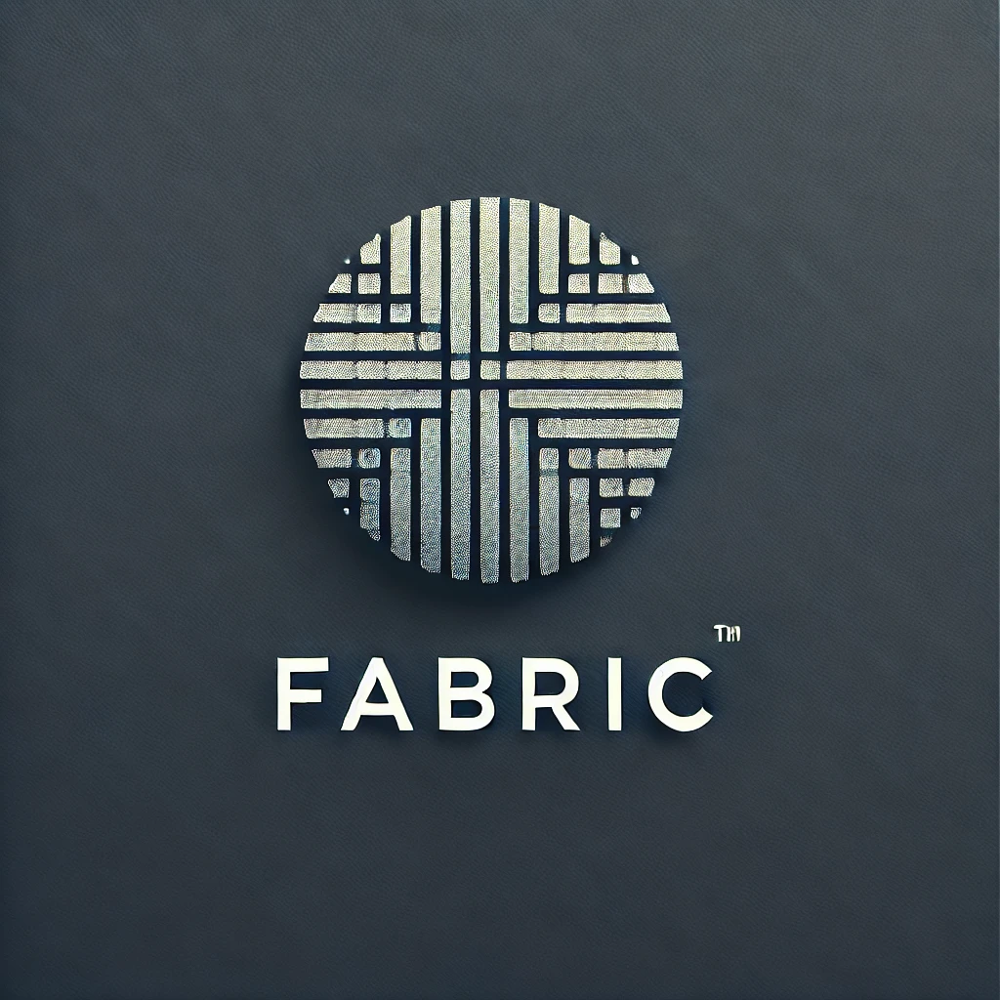

# 🧵 Fabric Docs

  

## 🌟 Overview

Fabric is a powerful command-line tool that leverages AI to analyze, generate, and manipulate text in various ways. It offers a wide range of patterns for tasks such as summarization, content creation, code analysis, and more. Here are some things that make using it a bit easier initially

## 🚀 Cheatsheet Sections

- 🧵 **Piping**: Connects output of one command to input of another
- 📊 **Analysis Patterns**: Evaluate answers, fact-check claims, analyze debates, and more.
- 📝 **Summarization Patterns**: Create concise summaries of long articles, papers, and documents.
- 🎨 **Creation Patterns**: Generate academic papers, AI job analyses, aphorisms, and various other content types.
- 🔍 **Extraction Patterns**: Extract key insights, ideas, and patterns from complex texts.
- 🔧 **Improvement Patterns**: Enhance academic writing, AI prompts, and general writing quality.
- 🏆 **Evaluation Patterns**: Assess content quality, find logical fallacies, and rate AI-generated responses.
- 🧩 **Miscellaneous Patterns**: Perform various specialized tasks like creating user stories, explaining code, and generating flashcards.

## 🔗 Pattern Combinations

Explore powerful combinations of Fabric patterns for more complex tasks:

- [General Pattern Combinations](pattern-combinations/general-pattern-combination-examples.md): Examples of combining various Fabric patterns for versatile applications.
- [Security Pattern Combinations](pattern-combinations/security-pattern-combination-examples.md): Specialized combinations focused on cybersecurity applications.

## 📚 Documentation

[Wiki](fabric-wiki.md) or [Cheatsheet](fabric-cheatsheet.md) depending on preference

## 🛠️ Usage

To generate innovative pattern combination ideas:

1. Choose either the [Wiki](fabric-wiki.md) or [Cheatsheet](fabric-cheatsheet.md) based on your preference.
2. Feed the selected document into your preferred Large Language Model (LLM).
3. Ask the LLM to generate pattern combination ideas based on the provided information.
4. A couple of examples are provided in the [pattern-combinations](pattern-combinations/) directory.

This approach allows you to leverage AI to create unique and powerful combinations of Fabric patterns tailored to your specific needs.

## 📄 License

This project is licensed under the [MIT License](LICENSE).

## 👥 Authors

- CybSecGit - [GitHub](https://github.com/CybSecGit)

## 🙏 Acknowledgements

- Fabric - [GitHub](https://github.com/danielmiessler/fabric)

---

Made with ❤️ by CybSecGit
